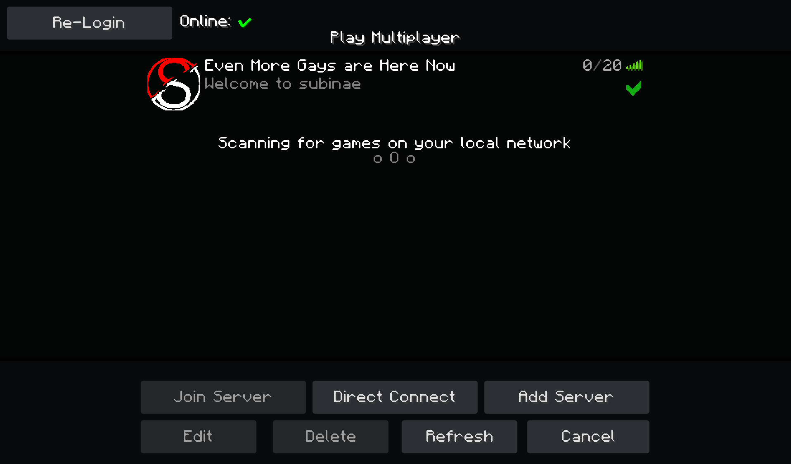
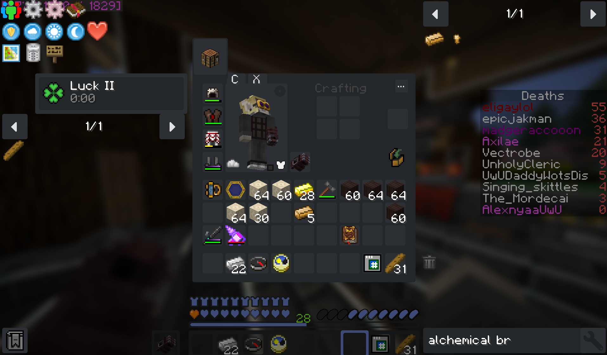
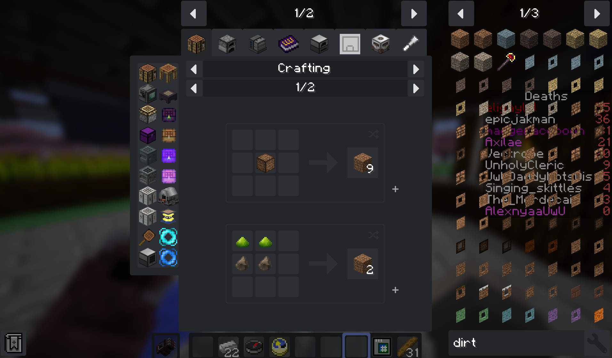
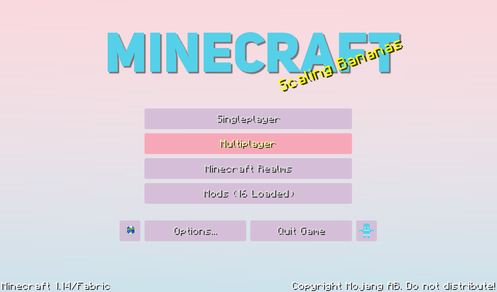
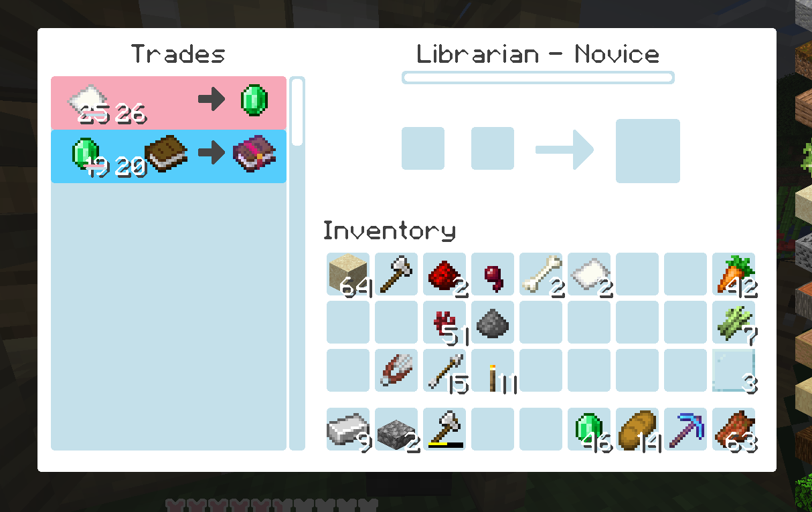
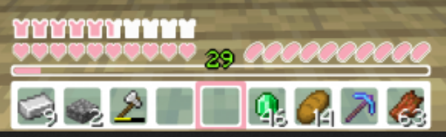

# Discraft HD

##### Dark Minecraft UI

Discraft is a Minecraft full GUI replacement that closely follows the design cues of Discord through the use of its color palette and I try to emulate its smooth SVG edges by using a reletively high resolution for a GUI pack

**Screenshots**

****

**Mod Support:**

​	I've started to slowly add support for mods using a custom 1.12.2 modpack as a goal for now. So far, I've completed adding support for these mods:

- **Tinkers Construct**
- **JEI**
- **Baubles**
- **Iron Chests**
- **Appleskin / AppleCore**
- **Actually Additions**
- **RFTools**

**Whats up with the name?**

​	It's heavily inspired by the design language and palette of Discord, and its reletively catchy. I did later find out that there is an existing mod for minecraft also called discraft, so I will likely need to change the name at some point, but at this point it would be a bit of pain to do so I'm waiting until I get something really good.

**Why?**

I like dark themes, I know how to use gimp, and tedious work is relaxing.

**Alternative Platforms**

[Minecraft Forum](https://www.minecraftforum.net/forums/mapping-and-modding-java-edition/resource-packs/2963356-discraft-1-14-x16-x64-gui-dark-and-light-mode-for) - [Planet Minecraft](https://www.planetminecraft.com/texture_pack/discraft-hd-dark-mode-for-minecraft/) - [Curseforge](https://www.curseforge.com/minecraft/texture-packs/discraft-hd)

**Light mode**

​	I did, for some reason make a Light version of this pack. It's color scheme is White / Pink / Light Blue and its pretty soft ngl. I made it by converting my first complete vanilla 1.14 version of Discraft to it over the course of a week or so, so it should be fully compatible with that version, but I don't plan on continueing to keep it up to date as almost no one has shown any interest in it. For now I'll just leave it here for the one or two people who like it by the look of it. trans rights.

**[Get it here](https://www.planetminecraft.com/texture_pack/discraft-hd-light-mode/)**

**Screenshots**

