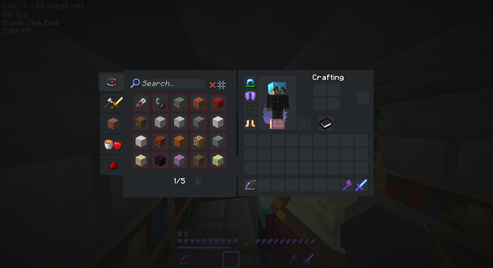
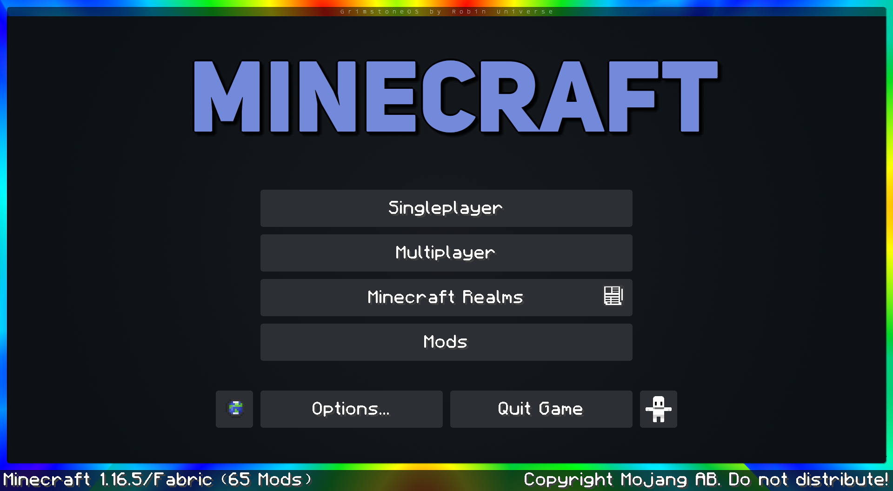
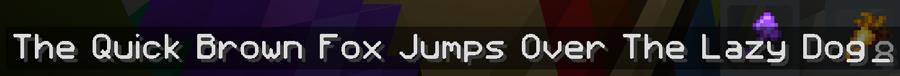

# GrimstoneOS

##### Dark Minecraft UI 

GrimstoneOS is a Minecraft full GUI replacement that closely follows the design cues of Discord through the use of its color palette and I try to emulate its smooth SVG edges by using a relatively high resolution for a GUI pack

Current supported version is **1.16.5**

**Every GUI menu replaced:**

I've put a lot of work into making sure that every single container element in the game has been replaced using as consistent a design language as I can manage

**Main Menu:**

I found a way to create some interesting effects on the main menu ( Turns out you can rescale the panorama_overlay file, and it's not forced to be opaque, so the file that's normally responsible for putting that gross white gradient over the panorama can be used to make some interesting graphics, ie this sweeping rainbow animation in the background )

**Custom Font:**

this is something I have worked on, implemented in various texture packs going all the way back to 2013 - and I FINALLY can say that I am actually happy with it. I hope that comes through

**Mod Support:**

​	I've started to slowly add support for mods using a custom 1.12.2 modpack as a goal for now. So far, I've completed adding support for these mods:

- **Tinkers Construct**
- **JEI**
- **Baubles**
- **Iron Chests**
- **Appleskin / AppleCore**
- **Actually Additions**
- **RFTools**

****

**Whats up with the name?**

​	The name of this resource pack used to be *Discraft HD* but I have since found a better sounding name that is not taken, I had a poll on twitter to find what variant sounded the best and ultimated that is how I landed on GrimstoneOS

**Why?**

I like dark themes, I know how to use gimp, and tedious work is relaxing.

**Alternative Platforms**

[Minecraft Forum](https://www.minecraftforum.net/forums/mapping-and-modding-java-edition/resource-packs/2963356-discraft-1-14-x16-x64-gui-dark-and-light-mode-for) - [Planet Minecraft](https://www.planetminecraft.com/texture_pack/discraft-hd-dark-mode-for-minecraft/) - [Curseforge](https://www.curseforge.com/minecraft/texture-packs/discraft-hd)

**Light mode**

​	I did, for some reason make a Light version of this pack. It's color scheme is White / Pink / Light Blue and its pretty soft ngl. I made it by converting my first complete vanilla 1.14 version of Discraft to it over the course of a week or so, so it should be fully compatible with that version, but I don't plan on continueing to keep it up to date as almost no one has shown any interest in it. For now I'll just leave it here for the one or two people who like it by the look of it. trans rights.

**[Get it here](https://www.planetminecraft.com/texture_pack/discraft-hd-light-mode/)**

**Screenshots**

